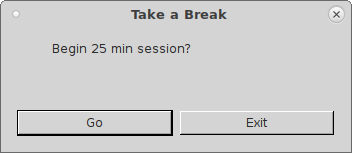
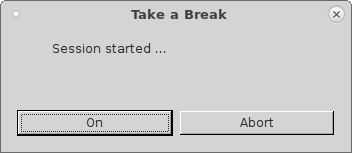
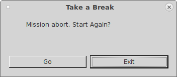
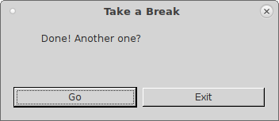

# take-a-break
Simple python (PyQt) timer with custom function execution upon timeout.

Very useful to remind yourself to take a break!

Here is how it looks on a new start:

After starting timer:

After aborting timer:

When done:

take-a-break(mate) is an executable file for MATE DE (tested on debian stretch).

Full tutorial may be found [here](https://bekspace.com/posts/201901/take-a-break.html)
